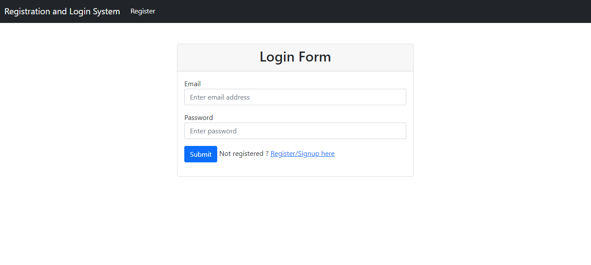

# Authentication App

## Overview
This is a simple authentication app developed using Spring Boot, Thymeleaf, and MySQL database. It provides user authentication features, allowing users to register, log in, and access protected resources.

## Features
- User registration
- User login/logout
- Password encryption
- Session management
- MySQL database integration

## Live Site
[](https://springboot-auth-app.up.railway.app/)

Visit the [live site](https://springboot-auth-app.up.railway.app/) for a demo.

## Technologies Used
- Spring Boot
- Thymeleaf
- MySQL

## Prerequisites
Before running the application, make sure you have the following installed:
- Java JDK [Download](https://www.oracle.com/java/technologies/javase-downloads.html)
- MySQL [Download](https://dev.mysql.com/downloads/)

## Setup
1. Clone the repository:
   ```bash
   git clone https://github.com/your-username/authentication-app.git
   cd authentication-app

## Usage
1. Open the application in your browser.
2. Register a new account or log in with existing credentials.
3. Explore the authentication features.
